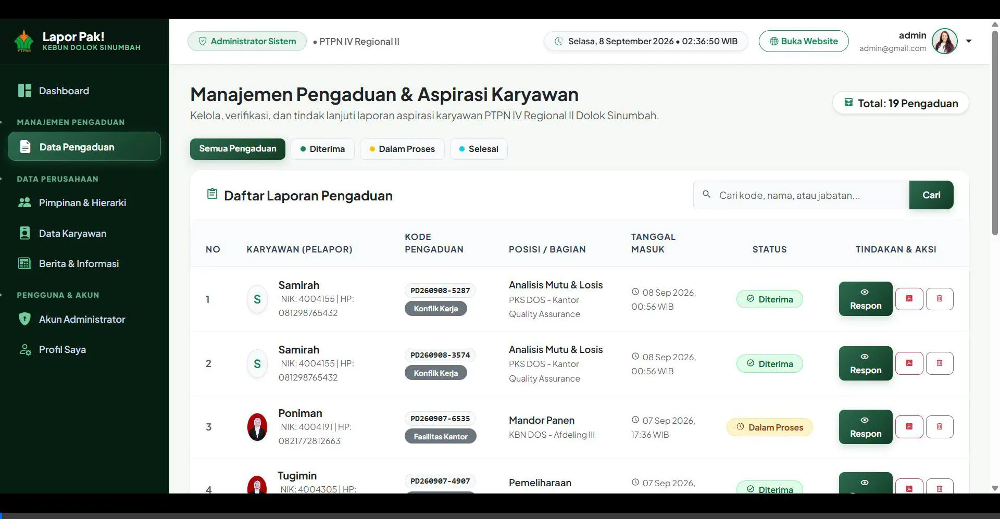

 Lapor Pak! – Sistem Informasi Layanan Aspirasi & Pengaduan Karyawan
PT Perkebunan Nusantara IV (Persero) Regional II Kebun Dolok Sinumbah


---

## 🎬 Live Interactive Demo Showcase



---

## 📌 Tentang Proyek & Latar Belakang (STAR Framework)

- **Situation (Kondisi):** Unit Perkebunan Kelapa Sawit PTPN IV Kebun Dolok Sinumbah membutuhkan saluran pengaduan dan aspirasi internal karyawan yang terintegrasi, transparan, dan terpercaya guna mendukung *Good Corporate Governance* (GCG) dan Keselamatan Kerja (K3).
- **Task (Tantangan):** Membangun sistem berbasis web yang memudahkan karyawan mengajukan keluhan/aspirasi dengan validasi data real-time, perlindungan identitas (*whistleblowing*), pelacakan tiket digital mandiri, serta panel disposisi respon pimpinan.
- **Action (Solusi Teknis):** Mengembangkan aplikasi full-stack menggunakan Laravel dengan arsitektur MVC, integrasi AJAX cascading dropdowns untuk data multi-afdeling, generator tiket acak unik, ekspor dokumen Berita Acara PDF, dan dashboard analitik eksekutif.
- **Result (Hasil):** Sistem siap pakai (*production-ready*) dengan alur pelaporan terstruktur dari registrasi tiket hingga disposisi penyelesaian resmi oleh manajemen.

---

## ✨ Fitur Unggulan Sistem

### 1. 👥 Portal Karyawan & Publik
- **Formulir Pengaduan Multi-Tingkat (*Cascading Dynamic Select2*):**
  - Pemilihan hierarki berjenjang: *Afdeling / Unit Kerja &rarr; Bagian &rarr; Jabatan &rarr; Nama Karyawan*.
  - Auto-fill Nomor Induk Karyawan (NIKSAP) otomatis.
  - Upload berkas lampiran pendukung (*Foto Bukti & Dokumen PDF*).
  - Generator otomatis **Kode Tiket Pengaduan Unik** (contoh: `PD260908-1234`).
- **Pusat Pelacakan Real-Time (*Live Ticket Tracking*):**
  - Pelacakan status instan menggunakan **Kode Tiket** atau **NIKSAP**.
  - Indikator 3 Tahap Status Visual: `Diterima` &rarr; `Sedang Diproses` &rarr; `Selesai`.
- **Cetak Dokumen PDF Berita Acara Resmi:**
  - Export berkas pengaduan ke format PDF standar korporasi secara otomatis menggunakan *DomPDF*.
- **Portal Berita & Informasi Kebun:**
  - Update operasional panen, sertifikasi RSPO/ISPO, dan agenda kebun.

### 2. 🔐 Panel Administrator & Pimpinan
- **Dashboard Analitik Eksekutif:**
  - 4 Kartu Metrik Ringkasan (*Total Laporan Masuk, Selesai, Dalam Proses, Total SDM*).
  - Indikator rasio tingkat penyelesaian aspirasi.
  - Real-time WIB Digital Clock Ticker dinamis.
- **Manajemen Pimpinan & Hierarki Dinamis:**
  - Pengurutan jabatan pimpinan secara visual dengan fitur **Drag-and-Drop** (`SortableJS`) & tombol reorder cepat.
- **Tindak Lanjut & Disposisi Pengaduan:**
  - Filter status laporan (*Semua, Diterima, Dalam Proses, Selesai*).
  - Modal disposisi & verifikasi resmi pimpinan dengan lampiran balasan.
- **Master Data Karyawan & Berita:**
  - Manajemen CRUD terpadu data karyawan dan publikasi berita kebun.

---

---

## 🛠️ Tech Stack & Dependencies
- **Backend Framework:** Laravel 9 / 10 (PHP 8.2)
- **Database:** MySQL
- **Frontend:** Bootstrap 5, Custom Agribusiness Theme, Google Fonts (Plus Jakarta Sans & Inter)
- **Libraries:**
  - `Select2` (Cascading Dynamic AJAX)
  - `SortableJS` (Drag-and-Drop Reordering)
  - `Barryvdh/DomPDF` (Automated PDF Generator)
  - `Bootstrap Icons` & `MDI Icons`

---

## 🔑 Akun & Kredensial Demo
| Role | Email Login | Password | Akses Fitur |
|---|---|---|---|
| **Super Administrator** | `admin@gmail.com` | `123456` | Akses penuh dashboard, disposisi, CRUD karyawan & pimpinan |
| **Kepala Bagian** | `kepalabagian@gmail.com` | `123456` | Verifikasi laporan & tanggapan resmi manajemen |
| **Asisten TU** | `asistentu@gmail.com` | `123456` | Pengawasan laporan operasional unit |

---

## 💻 Panduan Instalasi Lokal (Setup Guide)

1. **Clone Repositori:**
   ```bash
   git clone https://github.com/Azilatarigan01/laporpak-ptpn4.git
   cd laporpak-ptpn4
   ```

2. **Install Dependensi Composer:**
   ```bash
   composer install
   ```

3. **Konfigurasi File `.env`:**
   ```bash
   cp .env.example .env
   php artisan key:generate
   ```

4. **Import Database:**
   File dump database siap pakai telah disertakan di:
   ```bash
   database/database_laporpak.sql
   ```
   *(Dapat di-import langsung melalui phpMyAdmin atau MySQL CLI).*

5. **Jalankan Aplikasi:**
   ```bash
   php artisan serve
   ```
   Buka di browser: `http://127.0.0.1:8000`

---

## 👤 Pengembang
- **Nama:** Nur Azila Tarigan
- **GitHub:** [@Azilatarigan01](https://github.com/Azilatarigan01)
- **Proyek Kerja Praktik (KP):** PT Perkebunan Nusantara IV (Persero) Regional II Kebun Dolok Sinumbah
