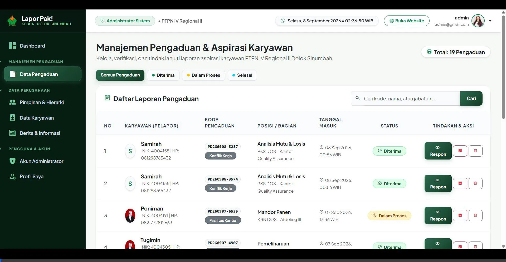

# Lapor Pak! – Sistem Informasi Layanan Aspirasi & Pengaduan Karyawan
### PT Perkebunan Nusantara IV (Persero) Regional II Kebun Dolok Sinumbah


-blue?style=for-the-badge)


---

## 🎬 Live Interactive Demo Showcase



---

## 📌 Tentang Proyek & Latar Belakang (STAR Framework)

- **Situation (Kondisi):** Unit Perkebunan Kelapa Sawit PTPN IV Kebun Dolok Sinumbah membutuhkan saluran pengaduan dan aspirasi internal karyawan yang terintegrasi, transparan, dan terpercaya guna mendukung *Good Corporate Governance* (GCG) dan Keselamatan Kerja (K3).
- **Task (Tantangan):** Membangun sistem berbasis web yang memudahkan karyawan mengajukan keluhan/aspirasi dengan validasi data real-time, perlindungan identitas (*whistleblowing*), pelacakan tiket digital mandiri, notifikasi otomatis, serta panel disposisi respon pimpinan.
- **Action (Solusi Teknis):** Mengembangkan aplikasi full-stack menggunakan Laravel dengan arsitektur MVC, integrasi AJAX cascading dropdowns untuk data multi-afdeling, generator tiket acak unik, ekspor dokumen Berita Acara PDF, integrasi notifikasi Telegram/WhatsApp, survei CSAT, dan dashboard analitik eksekutif teroptimasi.
- **Result (Hasil):** Sistem siap pakai (*production-ready*) dengan alur pelaporan terstruktur dari registrasi tiket hingga disposisi penyelesaian resmi oleh manajemen, lulus 26 automated unit & feature tests.

---

## ✨ Fitur Unggulan Sistem

### 1. 👥 Portal Karyawan & Publik
- **Formulir Pengaduan Multi-Tingkat (*Cascading Dynamic Select2*):**
  - Pemilihan hierarki berjenjang: *Area Kerja &rarr; Bagian Realisasi (Afdeling I s/d IX / TU) &rarr; Posisi Jabatan &rarr; Nama Karyawan*.
  - Auto-fill Nomor Induk Karyawan (NIKSAP) otomatis.
  - Upload berkas lampiran pendukung (*Foto Bukti Fisik & Dokumen PDF Maks 2MB*).
  - Generator otomatis **Kode Tiket Pengaduan Unik** (contoh: `PD261006-4821`).
- **🛡️ Opsi Perlindungan Whistleblower (Pelaporan Anonim / Rahasia):**
  - Tombol toggle untuk menyamarkan identitas pelapor dan NIKSAP dari tampilan publik dan cetakan laporan guna menjamin keselamatan karyawan.
- **Pusat Pelacakan Real-Time (*Live Ticket Tracking*):**
  - Pelacakan status instan menggunakan **Kode Tiket** atau **NIKSAP**.
  - Indikator Visual Stepper 3 Tahap: `Diterima` &rarr; `Dalam Proses` &rarr; `Selesai`.
  - Durasi penanganan real-time (*Resolution Turnaround Time*).
- **⭐ Survei Kepuasan Layanan Pelapor (CSAT 1–5 Bintang & Ulasan):**
  - Form penilaian interaktif setelah aduan tuntas ditangani untuk mengukur kualitas respon manajemen.
- **Cetak Dokumen PDF Berita Acara Resmi:**
  - Export berkas pengaduan ke format PDF standar korporasi ber-Kop Surat Resmi PTPN IV Regional II Kebun Dolok Sinumbah via *DomPDF*.
- **Portal Berita & Informasi Kebun:**
  - Publikasi operasional panen, sertifikasi RSPO/ISPO, dan agenda perkebunan.

### 2. 🔐 Panel Administrator & Pimpinan
- **Dashboard Analitik Eksekutif Teroptimasi:**
  - Metrik Ringkasan (*Total Laporan Masuk, Diterima, Dalam Proses, Selesai, Total SDM*).
  - Single-query aggregated database engine (bebas query ganda).
  - Grafik tren bulanan dan grafik distribusi per-Afdeling.
  - Real-time WIB Digital Clock Ticker dinamis.
- **Tindak Lanjut & Disposisi Pengaduan:**
  - Filter status laporan (*Semua, Diterima, Dalam Proses, Selesai*).
  - **Peringatan Overdue SLA (`⚠️ Overdue SLA`)** untuk laporan yang belum ditindaklanjuti >3 hari kerja.
  - Modal disposisi & verifikasi resmi pimpinan dengan pencatatan audit log nama petugas (`petugas_nama`) dan waktu respon (`tgl_tanggapan`).
  - Cetak **Lembar Disposisi Lapangan** resmi untuk penugasan fisik mandor/asisten afdeling.
- **📊 Rekapitulasi Laporan & Export Data Eksekutif:**
  - Filter laporan berdasarkan rentang tanggal, bagian afdeling, kategori, dan status.
  - Export Rekapitulasi ke **Microsoft Excel (.csv kompatibel UTF-8 BOM)**.
  - Export Rekapitulasi ke **PDF Lanskap Laporan Eksekutif Direksi**.
- **🔔 Notifikasi Otomatis Multi-Channel:**
  - Notifikasi instan ke **Telegram Bot Grup Personalia/Admin** saat ada laporan baru.
  - Notifikasi balasan ke **WhatsApp Pelapor** (via Fonnte Gateway) saat status diperbarui.
- **Manajemen Pimpinan & Hierarki Dinamis:**
  - Pengurutan jabatan pimpinan secara visual dengan fitur **Drag-and-Drop** (`SortableJS`) & tombol reorder cepat.
- **Master Data Karyawan & Berita:**
  - Manajemen CRUD terpadu data karyawan dan publikasi berita kebun.

---

## 🛡️ Keamanan & Kualitas Kode (Code Quality)
- **Role-Based Access Control (RBAC):** Rute manajemen status dan dokumen internal dilindungi middleware `auth` dan `admin`.
- **Zero N+1 Query:** Eager loading bertingkat (`posisi.realisasi.area`) untuk efisiensi memori RAM dan kueri database.
- **Sanitasi File Upload:** Validasi MIME type, ekstensi berkas, dan batasan ukuran 2MB.

---

## 🛠️ Tech Stack & Dependencies
- **Backend Framework:** Laravel 9 / 10 (PHP 8.2)
- **Database:** MySQL 8.0 / MariaDB
- **Frontend:** Bootstrap 5, Custom Agribusiness Corporate Theme, Google Fonts (Plus Jakarta Sans & Inter)
- **Libraries:**
  - `Select2` (Cascading Dynamic AJAX)
  - `SortableJS` (Drag-and-Drop Hierarchy Reordering)
  - `Barryvdh/DomPDF` (Automated PDF Generator)
  - `Chart.js` (Analitik Visual Dashboard)
  - `Bootstrap Icons` & `MDI Icons`

---

## 🔑 Akun & Kredensial Demo
| Role | Email Login | Password | Akses Fitur |
|---|---|---|---|
| **Super Administrator** | `admin@gmail.com` | `123456` | Akses penuh dashboard, disposisi, CRUD karyawan & pimpinan, ekspor laporan |
| **Kepala Bagian** | `asistentu@gmail.com` | `123456` | Verifikasi laporan divisi, disposisi lapangan & rekap laporan |

---

## 💻 Panduan Instalasi Lokal (Setup Guide)

1. **Clone Repositori:**
   ```bash
   git clone https://github.com/Azilatarigan01/laporpak-ptpn4.git
   cd laporpak-ptpn4
   ```

2. **Install Dependensi Composer & Node.js:**
   ```bash
   composer install
   npm install
   ```

3. **Konfigurasi File `.env`:**
   ```bash
   cp .env.example .env
   php artisan key:generate
   ```

4. **Konfigurasi Database & Jalankan Migrasi:**
   Sesuaikan `DB_DATABASE=lapor`, `DB_USERNAME=root`, `DB_PASSWORD=` di `.env`, lalu jalankan:
   ```bash
   php artisan migrate
   ```
   *(Atau import file SQL siap pakai dari `database/database_laporpak.sql` melalui phpMyAdmin).*

5. **Hubungkan Storage:**
   ```bash
   php artisan storage:link
   ```

6. **Jalankan Automated Tests:**
   ```bash
   npm run test
   # atau: php artisan test
   ```

7. **Jalankan Aplikasi:**
   ```bash
   php artisan serve
   ```
   Buka di browser: `http://127.0.0.1:8000`

---

## 🧪 Pengujian Otomatis (Test Suite)

Aplikasi dilengkapi 26 automated feature & unit tests yang menguji seluruh endpoint publik, AJAX, keamanan middleware, serta alur kerja role Admin dan Kepala Bagian:
```bash
npm run test
```
Hasil: **`Tests: 26 passed (100% Lulus)`**

---

## 👤 Pengembang
- **Nama:** Nur Azila Tarigan
- **GitHub:** [@Azilatarigan01](https://github.com/Azilatarigan01)
- **Proyek Kerja Praktik (KP):** PT Perkebunan Nusantara IV (Persero) Regional II Kebun Dolok Sinumbah
